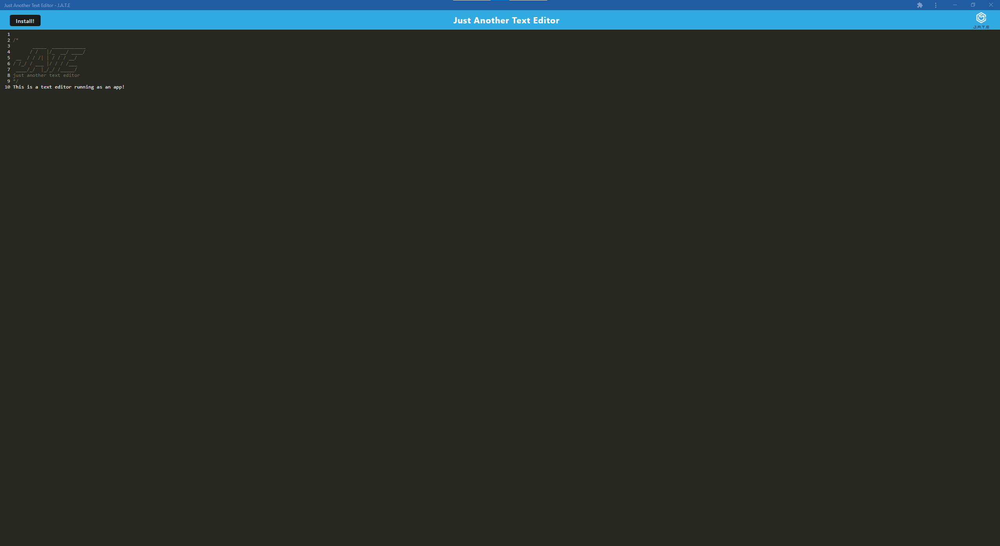

# Text Editor

## Table of Contents
  - [Description](#description)
  - [Installation](#installation)
  - [Demo](#demo)

## Description
This application is a simple text editor running in the web browser. It also has an installable app to run it offline. Users can run this application and type in whatever they want! It can be used to take memos, write up shopping lists and many more! Work between the browser version and desktop version is synchronized.

## Installation
To access this application, simply visit the link <a href='https://jate-text-editor-ghassan.herokuapp.com/'>here</a>. To install it, click the 'install' button in the top left corner of the page and accept the prompt that appears in the top right of the browser.

## Demo

